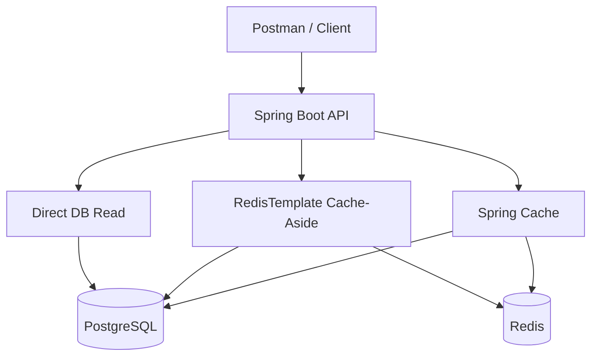

# CacheLab — Redis & Spring Cache Laboratory


CacheLab, Redis ve cache mekanizmalarını yalnızca kullanmak değil, davranışlarını gözlemleyerek öğrenmek amacıyla geliştirilmiş bir Spring Boot projesidir.

Projede bilinçli olarak yalnızca bir JPA entity’si (`Product`) bulunur. Amaç domain modelini büyütmek değil; cache hit/miss, TTL, invalidation, fallback ve Spring AOP proxy davranışı gibi konulara odaklanmaktır.

## Projenin amacı

Bu projede aynı ürün verisi farklı yöntemlerle okunur:

- Doğrudan PostgreSQL sorgusu
- `RedisTemplate` ile manuel cache-aside
- `@Cacheable` ile declarative cache
- Uygulama belleğinde local cache

Her yaklaşımın süresi, cache kaynağı ve veritabanı okuma sayısı API cevaplarında gözlemlenebilir.

## Öğrenilen konular

| Konu | Projedeki karşılığı |
|---|---|
| Cache-aside | `RedisTemplate` ile manuel hit/miss kontrolü |
| Declarative caching | `@Cacheable` ve Spring proxy mekanizması |
| Cold / warm cache | İlk ve sonraki isteklerin süre karşılaştırması |
| TTL | Cache anahtarlarının kalan ömrünü izleme |
| Cache invalidation | DB commit sonrasında ilgili key’leri silme |
| Cache metrics | Hit, miss, failure ve hit-rate sayaçları |
| Graceful fallback | Redis kapalıyken PostgreSQL’den devam etme |
| Self-invocation | Aynı bean içindeki çağrıda `@Cacheable`ın çalışmaması |
| Transaction consistency | Rollback sonrasında stale cache oluşması |
| Local vs distributed cache | İki uygulama instance’ı üzerinden tutarlılık farkı |
| Serialization | Redis değerlerini okunabilir JSON olarak saklama |
| Cache key design | Namespace ve versiyon içeren key yapısı |

## Mimari



## Teknolojiler

- Java 17+
- Spring Boot 3.5
- Spring Data JPA
- Spring Data Redis
- Spring Cache
- PostgreSQL 16
- Redis 7.4
- Docker Compose
- Maven
- Actuator
- Micrometer

## Domain modeli

Projede yalnızca bir entity bulunur:

```text
Product
├── id
├── name
├── category
├── price
├── stock
└── updatedAt
```

DTO, response record ve servis sınıfları entity değildir. Veritabanında yalnızca `products` tablosu oluşturulur.

## Kurulum

### Gereksinimler

- Java 17 veya üzeri
- Docker Desktop
- Maven 3.9+ veya IntelliJ IDEA

### PostgreSQL ve Redis’i başlatma

```bash
docker compose up -d
```

Container durumlarını kontrol et:

```bash
docker compose ps
```

PostgreSQL, bilgisayarda kurulu olabilecek yerel PostgreSQL’in standart `5432` portuyla çakışmaması için host üzerinde `55432` portunu kullanır.

### Uygulamayı başlatma

```bash
mvn spring-boot:run
```

IntelliJ IDEA kullanıyorsan `CacheLabApplication` sınıfını doğrudan çalıştırabilirsin.

Uygulama başladığında üç örnek ürün otomatik olarak eklenir.

### Sağlık kontrolü

```http
GET http://localhost:8080/actuator/health
```

Beklenen cevap:

```json
{
  "status": "UP"
}
```

## Temel endpoint’ler

| Method | Endpoint | Açıklama |
|---|---|---|
| `GET` | `/api/products` | Ürünleri listeler |
| `GET` | `/api/products/{id}` | Ürünü doğrudan DB’den okur |
| `POST` | `/api/products` | Yeni ürün oluşturur |
| `PUT` | `/api/products/{id}` | Ürünü günceller ve cache’i temizler |
| `DELETE` | `/api/products/{id}` | Ürünü siler |
| `POST` | `/api/products/{id}/purchase` | Ürün stoğunu azaltır |
| `GET` | `/api/cache-lab/compare/{id}` | DB, manual ve declarative sürelerini karşılaştırır |
| `GET` | `/api/cache-lab/manual/products/{id}` | Manuel cache-aside okuması yapar |
| `GET` | `/api/cache-lab/declarative/products/{id}` | `@Cacheable` ile okuma yapar |
| `GET` | `/api/cache-lab/ttl/{id}` | Cache key’lerinin TTL değerlerini gösterir |
| `GET` | `/api/cache-lab/stats` | Hit/miss istatistiklerini gösterir |
| `DELETE` | `/api/cache-lab/cache/{id}` | Ürüne ait cache key’lerini siler |

Hazır istekler için aşağıdaki Postman collection kullanılabilir:

```text
requests/cache-lab.postman_collection.json
```

## Deney 1 — Cold ve warm cache

```http
GET /api/cache-lab/compare/1
```

Bu endpoint sırasıyla şunları ölçer:

1. Cache’siz PostgreSQL sorgusu
2. Manual cache cold read
3. Manual cache warm read
4. Declarative cache cold read
5. Declarative cache warm read

Veritabanı okumasına öğretici olması için varsayılan olarak `1200 ms` yapay gecikme eklenmiştir. Böylece cold ve warm cache arasındaki fark response içinde açıkça görülür.

Beklenen sonuç:

```text
Database without cache ≈ 1200 ms
Manual cold cache      ≈ 1200 ms
Manual warm cache      ≈ birkaç ms
Declarative cold cache ≈ 1200 ms
Declarative warm cache ≈ birkaç ms
```

Manual ve declarative yöntemleri hız açısından yarıştırmak amaçlanmaz. İkisi de warm durumda Redis’ten veri getirir. Temel fark, cache kontrolünü kimin yaptığıdır.

## Deney 2 — Manuel cache-aside

Önce cache’i temizle:

```http
DELETE /api/cache-lab/cache/1
```

Ardından aynı isteği iki kez gönder:

```http
GET /api/cache-lab/manual/products/1
```

İlk istek:

```text
Redis MISS → PostgreSQL → Redis SET + TTL → Response
```

İkinci istek:

```text
Redis HIT → Response
```

Manuel cache-aside akışı `ManualProductCacheService` içerisinde `RedisTemplate` kullanılarak açık biçimde uygulanmıştır.

## Deney 3 — Declarative cache ve `@Cacheable`

Aynı isteği iki kez gönder:

```http
GET /api/cache-lab/declarative/products/1
```

İlk çağrıda cache boş olduğu için metot çalışır ve PostgreSQL’e sorgu gönderilir.

İkinci çağrıda Spring proxy Redis’teki değeri bulur ve cache’lenen metodun gövdesini çalıştırmadan sonucu döndürür.

```text
İlk çağrı  → Proxy → Cache MISS → Method → PostgreSQL → Redis
İkinci çağrı → Proxy → Cache HIT → Response
```

Manuel yöntemde cache kontrolünü uygulama kodu yaparken declarative yöntemde bu sorumluluğu Spring üstlenir.

## Deney 4 — TTL

Önce ürünü cache’e al:

```http
GET /api/cache-lab/manual/products/1
```

Ardından TTL değerini kontrol et:

```http
GET /api/cache-lab/ttl/1
```

Redis CLI üzerinden de TTL izlenebilir:

```bash
docker exec -it cache-lab-redis redis-cli TTL lab:manual:product:v1:1
```

Redis TTL cevapları:

- `0` veya üzeri: kalan saniye
- `-1`: Key var fakat expiration yok
- `-2`: Key bulunamadı

Varsayılan TTL 60 saniyedir.

## Deney 5 — Cache istatistikleri

Sayaçları sıfırla:

```http
POST /api/cache-lab/stats/reset
```

Aynı ürünü birkaç kez çağır:

```http
GET /api/cache-lab/manual/products/1
GET /api/cache-lab/manual/products/1
GET /api/cache-lab/manual/products/1
```

İstatistikleri görüntüle:

```http
GET /api/cache-lab/stats
```

Örnek sonuç:

```json
{
  "manual": {
    "requests": 3,
    "hits": 2,
    "misses": 1,
    "failures": 0,
    "hitRatePercent": 66.67
  },
  "databaseReads": 1
}
```

Sayaçlar eğitim amacıyla uygulama belleğinde tutulur. Uygulama yeniden başlatıldığında sıfırlanırlar.

Gerçek sistemlerde bu metrikler Micrometer, Prometheus ve Redis’in `keyspace_hits` / `keyspace_misses` değerleri üzerinden takip edilebilir.

## Deney 6 — Cache invalidation

Ürün güncellendiğinde yalnızca PostgreSQL’i değiştirmek, Redis’te eski veri kalmasına neden olabilir.

Projede kullanılan doğru akış:

```text
DB Update → Transaction Commit → Cache Eviction
```

Örnek güncelleme:

```http
PUT /api/products/1
Content-Type: application/json

{
  "name": "Mechanical Keyboard",
  "category": "ACCESSORY",
  "price": 2799.90,
  "stock": 25
}
```

Transaction başarıyla commit edildikten sonra ürüne ait cache key’leri silinir.

Bir sonraki GET isteği cache miss üretir, güncel ürünü PostgreSQL’den okur ve cache’i yeniden doldurur.

## Deney 7 — Self-invocation tuzağı

Broken senaryo:

```http
GET /api/cache-lab/experiments/self-invocation/broken/1
```

Aynı bean içerisindeki cache’li metodun doğrudan çağrılması Spring proxy’sini devre dışı bırakır.

```java
this.cachedMethod(productId);
```

Metotta `@Cacheable` bulunsa bile proxy kullanılmadığı için cache davranışı uygulanmaz. Her çağrı PostgreSQL’e gider.

Fixed senaryo:

```http
GET /api/cache-lab/experiments/self-invocation/fixed/1
```

Cache’li metot ayrı bir Spring bean’ine taşındığı için çağrı proxy üzerinden geçer. İlk istek PostgreSQL’e giderken ikinci istek Redis’ten döner.

## Deney 8 — Redis kapandığında fallback

Redis’i durdur:

```bash
docker stop cache-lab-redis
```

Ardından cache endpoint’lerinden birini çağır:

```http
GET /api/cache-lab/manual/products/1
```

```http
GET /api/cache-lab/declarative/products/1
```

Redis erişilebilir olmadığında uygulama tamamen çökmez. Cache hatası kaydedilir ve veri PostgreSQL’den getirilmeye devam eder.

Redis’i yeniden başlat:

```bash
docker start cache-lab-redis
```

Bu deney, cache’in ana veri kaynağı olmadığını ve cache erişilemediğinde uygulamanın nasıl davranması gerektiğini gösterir.

## Deney 9 — Transaction rollback ve stale cache

Broken senaryo:

```http
POST /api/cache-lab/experiments/rollback/broken/1?attemptedPrice=99999.00
```

Bu senaryoda:

1. Ürün fiyatı transaction içinde değiştirilir.
2. Transaction tamamlanmadan Redis güncellenir.
3. Bilerek exception fırlatılır.
4. PostgreSQL işlemi rollback olur.
5. Redis aynı transaction’ın parçası olmadığı için yeni değer cache’te kalır.

Sonuç:

```text
PostgreSQL → Eski fiyat
Redis      → Yeni fiyat
staleCache → true
```

Fixed senaryo:

```http
POST /api/cache-lab/experiments/rollback/fixed/1?attemptedPrice=88888.00
```

Cache işlemi commit sonrasına ertelenir. Transaction rollback olduğunda cache değiştirilmez.

```text
PostgreSQL → Eski fiyat
Redis      → Eski fiyat
staleCache → false
```

## Deney 10 — Local cache ve Redis farkı

Uygulama iki farklı portta çalıştırıldığında her instance kendi local cache’ine sahiptir. Redis ise iki instance tarafından ortak kullanılır.

```bash
SERVER_PORT=8080 INSTANCE_ID=A mvn spring-boot:run
SERVER_PORT=8081 INSTANCE_ID=B mvn spring-boot:run
```

Bir instance üzerinden yapılan güncelleme, diğer instance’ın local cache’inde stale veri bırakabilir.

```text
Instance A → Local Cache A
Instance B → Local Cache B
```

Redis kullanıldığında iki instance aynı cache alanını paylaşır:

```text
Instance A ─┐
            ├── Redis
Instance B ─┘
```

Bu deney, birden fazla uygulama instance’ı bulunan sistemlerde neden yalnızca `ConcurrentHashMap` gibi local cache çözümlerine güvenilemeyeceğini gösterir.

## JSON serialization

Manual cache endpoint’ini çağırdıktan sonra Redis’te saklanan değeri incele:

```bash
docker exec -it cache-lab-redis redis-cli --raw GET lab:manual:product:v1:1
```

Cache değeri okunabilir JSON olarak görüntülenir.

Projede JDK binary serializer yerine `Jackson2JsonRedisSerializer<ProductResponse>` kullanılmasının nedenleri:

- Redis CLI üzerinden değerlerin okunabilmesi
- Debug işlemlerinin kolaylaşması
- Farklı teknolojilerdeki servislerin JSON formatını anlayabilmesi
- Binary serialization bağımlılığının azaltılması

## Cache key yapısı

Projede kullanılan örnek key’ler:

```text
lab:manual:product:v1:1
lab:declarative:product:v1::1
lab:self-invocation:product:v1::1
lab:rollback:product:v1::1
```

Key yapısındaki alanlar:

- `lab`: Projenin namespace’i
- `manual`, `declarative`: Cache’in kullanım amacı
- `product`: Veri türü
- `v1`: Cache şema versiyonu
- `1`: Product ID

Namespace kullanımı farklı cache alanlarının birbiriyle çakışmasını engeller. Versiyon bilgisi ise DTO yapısı değiştiğinde eski cache verilerinin yeni verilerden ayrılmasını sağlar.

Key’leri listelemek için:

```bash
docker exec -it cache-lab-redis redis-cli --scan --pattern "lab:*"
```

## Redis CLI kullanımı

Redis CLI’ı Docker container içinde aç:

```bash
docker exec -it cache-lab-redis redis-cli
```

Yararlı komutlar:

```redis
PING
SCAN 0 MATCH lab:*
TTL lab:manual:product:v1:1
GET lab:manual:product:v1:1
INFO memory
INFO stats
```

CLI’dan çıkmak için:

```redis
EXIT
```

## Önemli sınıflar

| Sınıf | Sorumluluk |
|---|---|
| `Product` | Projedeki tek JPA entity’si |
| `ProductDatabaseReader` | Yapay gecikmeli DB okuması ve okuma sayacı |
| `ManualProductCacheService` | `RedisTemplate` ile cache-aside |
| `DeclarativeProductCacheLoader` | `@Cacheable` kullanılan ürün okuması |
| `CacheConfig` | TTL, JSON serializer ve cache error handler ayarları |
| `CacheComparisonService` | Cold/warm süre karşılaştırması |
| `SelfInvocationExperimentService` | Spring proxy ve self-invocation deneyi |
| `RollbackMutationService` | Transaction rollback ve stale cache deneyi |
| `LocalProductCacheService` | Instance bazlı local cache deneyi |

## Yapılandırma

| Değişken | Varsayılan | Açıklama |
|---|---:|---|
| `SERVER_PORT` | `8080` | Uygulama portu |
| `INSTANCE_ID` | Uygulama portu | Instance adı |
| `CACHELAB_DB_DELAY` | `1200ms` | Yapay DB gecikmesi |
| `CACHELAB_CACHE_TTL` | `60s` | Product cache TTL’i |
| `REDIS_HOST` | `localhost` | Redis adresi |
| `REDIS_PORT` | `6379` | Redis portu |

Demo PostgreSQL bağlantısı:

```text
URL      : jdbc:postgresql://127.0.0.1:55432/cachelab
Username : cachelab
Password : cachelab
```

## Container’ları durdurma

Uygulama deneyi bittiğinde container’ları durdur:

```bash
docker compose down
```

Demo verilerini ve volume’leri de temizlemek için:

```bash
docker compose down -v
```

## Projenin kapsamı

Bu proje production ortamına hazır bir e-ticaret sistemi olarak değil, Redis ve cache problemlerini kontrollü olarak oluşturup sonuçlarını gözlemleyebileceğim bir öğrenme laboratuvarı olarak geliştirilmiştir.

Security, kullanıcı, sepet veya sipariş gibi ek entity’ler bilinçli olarak eklenmemiştir. Projenin temel amacı Redis ve cache davranışlarını mümkün olduğunca açık ve ölçülebilir biçimde göstermektir.